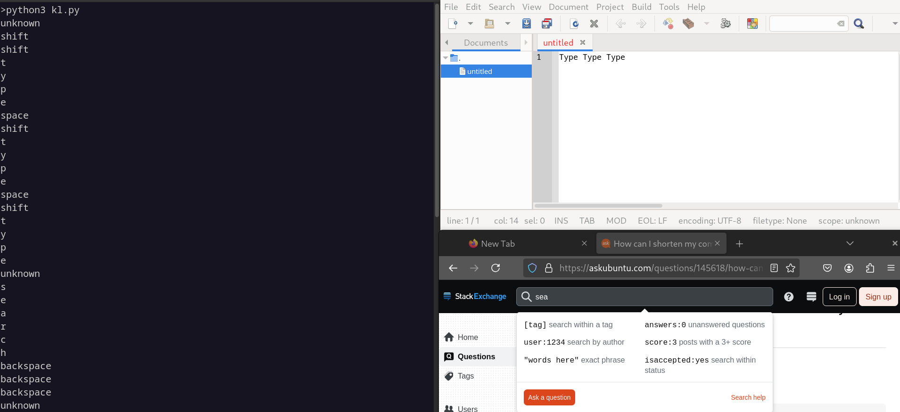

# simple keylogger

Keyloggers are simple to build in Python with the 'keyboard' module!



## Running from fun_with_cybersec folder
* First, follow instructions [here](https://github.com/FrozenBurrito/fun_with_cybersec/blob/main/README.md) to setup virtual environment.
* Running on Linux
```
source .venv/bin/activate
python simple_keylogger.py
```
* Running on Windows
```
scripts\activate.bat
python simple_keylogger.py
```

## Extension Activities
### Modify simple_keylogger.py
* Save the output to file.  
* Add a keyboard shortcut to turn on/off keylogging.
* Stream output remotely or schedule data dumps 
  * Try using sockets or ngrok+flask
    
### Command line only extension activities
* Run in background using '&'.
* Try streaming the output with netcat.
  * Server, Keylogger (ex: 10.2.0.5):
  ```
  python simple_keylogger.py | nc -lkv 7777
  python -m keyboard | nc -lkv 7778
  ```
  * Client (ex: 10.2.0.6; or, use a browser):
  ```  
  nc -zv 10.2.0.5 7777
  nc -zv 10.2.0.5 7778
  ```
* Remote keyboard injection is also possible with the keyboard module.
* The keyboard module can also be used as a standalone python module (i.e., python -m keyboard).
* Consider: Can the simple_keylogger.py output be sent to a file from the command line using >>?
  * [Hint: Requires modifying the code.](https://stackoverflow.com/questions/51199339/python-script-writes-no-output-when-stdout-is-redirected-to-a-file)

### On Linux, explore the /dev/input folder.  
Try:
```
ls -al /dev/input/by-id
sudo cat /dev/input/eventX | hexdump -C
```
Consider: How can we unpack the hexdump and determine which keys were pressed?  Hint:  See link below.
  
## Helpful Libraries and Links

* [keyboard module](https://github.com/boppreh/keyboard)
* [netcat man page](https://man7.org/linux/man-pages/man1/ncat.1.html)
* [ncat by nmap](https://nmap.org/ncat/guide/index.html)
* [Format of /dev/input/event struct](https://stackoverflow.com/questions/5060710/format-of-dev-input-event)
